# Prato do Dia - Computer Vision Pipeline

Prato do Dia is a food photo processing pipeline for top-down meal images. The
current backend flow detects food regions with YOLOv11, prompts SAM 2 with those
boxes, saves segmentation polygons in YOLO TXT format, and supports visual/IoU
evaluation against deterministic ground truth masks.

## Current Status

| Phase | Status | Output |
| --- | --- | --- |
| Phase 1 | Complete | `uv`, preprocessing, letterboxing |
| Phase 2 | Complete | ONNX YOLOv11 + SAM 2 inference |
| Phase 3 | In progress | overlays, IoU evaluation, label validation |

## Quick Commands

```bash
uv sync
uv run python scripts/run_pipeline.py data/input/imagem1.jpg --confidence 0.05 --max-detections 3
uv run python scripts/import_labelstudio_brush.py \
  --brush-dir data/annotation_exports/labelstudio/brush_masks \
  --coco-json data/annotation_exports/labelstudio/result_coco.json
uv run python scripts/evaluate_pipeline.py --config configs/default.toml --confidence 0.05 --max-detections 3
uv run python scripts/extract_features.py --config configs/default.toml
```

The evaluation script intentionally requires single-channel PNG instance masks
named `data/ground_truth/<stem>_instances.png`. JPEG masks introduce compression
artifacts and invalidate exact metrics.

## Visual Pipeline

```mermaid
flowchart LR
    A[Top-down meal photo] --> B[Letterbox preprocessing]
    B --> C[YOLOv11 ONNX detector]
    C --> D[Food bounding boxes]
    D --> E[SAM 2 ONNX encoder]
    E --> F[SAM 2 ONNX decoder]
    F --> G[Binary masks]
    G --> H[YOLO TXT polygons]
    H --> I[data/raw_segmentations]
```



## Repository Map

```text
src/
  preprocessing.py    # letterbox + BGR/RGB normalization
  detector.py         # YOLOv11 ONNX inference and decoding
  segmenter.py        # SAM 2 encoder/decoder inference
  annotations.py      # YOLO TXT writer
  config.py           # typed TOML config loader
  io_utils.py         # image loading, alpha/background handling, GT validation
  postprocessing.py   # mask cleanup and overlap resolution
  metrics.py          # rasterization, IoU/Dice/boundary/instance metrics
  feature_extraction.py # per-instance color, texture, shape, position features
  visualizer.py       # overlays and bounding boxes
  pipeline.py         # image -> detector -> segmenter -> artifacts

scripts/
  run_pipeline.py       # run one image
  import_labelstudio_brush.py # convert transient Label Studio exports to GT PNGs
  evaluate_pipeline.py  # run dataset evaluation and overlays
  extract_features.py   # export feature rows from generated instance masks

data/
  input/              # source meal photos
  ground_truth/       # single-channel <stem>_instances.png masks
  raw_segmentations/  # generated YOLO TXT polygons
  masks/              # generated instance and class PNG masks
  overlays/           # generated visual validation images
  reports/            # per-image metadata and evaluation report

models/
  yolov11_food.onnx
  sam2.1_hiera_tiny.encoder.onnx
  sam2.1_hiera_tiny.decoder.onnx
```

For a fuller visual explanation, see [docs/pipeline_overview.md](docs/pipeline_overview.md).
