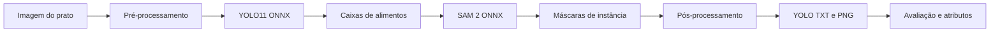

# Prato do Dia - Pipeline de Visão Computacional

Este repositório reúne o protótipo de segmentação de alimentos do projeto
Prato do Dia. O objetivo é estudar um fluxo reprodutível para imagens de
refeições capturadas de cima, combinando detecção por YOLO11 e segmentação
guiada por caixas com SAM 2.

O foco atual é experimental: produzir máscaras de instância, avaliar sua
qualidade contra anotações de referência e organizar artefatos que possam
apoiar etapas futuras de identificação alimentar e estimativa nutricional.

## Situação Atual

| Etapa | Situação | Entrega principal |
| --- | --- | --- |
| 1. Pré-processamento | concluída | leitura de imagem, normalização RGB e letterbox |
| 2. Inferência | concluída | YOLO11 + SAM 2 em ONNX Runtime CPU |
| 3. Validação | em andamento | máscaras PNG, overlays, IoU e métricas por instância |
| 4. Caracterização | inicial | extração de atributos de cor, textura, forma e posição |

## Hipótese de Trabalho

O pipeline parte da seguinte pergunta de pesquisa:

> Uma combinação leve de detector de objetos e segmentador por prompt consegue
> gerar máscaras de alimentos suficientemente estáveis para apoiar a
> identificação e a estimativa de porções em imagens de pratos?

Nesta fase, a prioridade não é entregar um aplicativo completo, mas manter uma
base técnica simples, testável e adequada para comparação entre experimentos.

## Fluxo Metodológico



Principais saídas geradas:

- `data/raw_segmentations/`: polígonos no formato YOLO segmentation.
- `data/masks/`: máscaras PNG de instância e classe.
- `data/overlays/`: visualizações para inspeção qualitativa.
- `data/reports/`: metadados e métricas de avaliação.
- `data/features/`: atributos extraídos das instâncias segmentadas.

## Interface pública para a API

O backend deve consumir o pacote por `prato_do_dia_ml.inference`, não por
classes internas do detector/segmentador:

```python
from pathlib import Path

from prato_do_dia_ml.inference import FoodPredictor

predictor = FoodPredictor.from_models_dir(Path("models"))
prediction = predictor.predict_bytes(image_bytes)
```

A resposta técnica é `PredictionResponse`, com dimensões da imagem, instâncias,
artefatos experimentais e metadados do modelo. A conversão para JSON de produto
e estimativas nutricionais pertence ao backend da API.

Erros públicos:

- `MLInvalidImageError`: bytes inválidos ou imagem não decodificável.
- `MLModelUnavailableError`: arquivos de modelo ausentes.
- `MLInferenceError`: falha interna durante inferência.

O manifesto `models/model_manifest.json` registra nome, papel, tamanho e SHA-256
dos modelos ONNX esperados.

## Como Reproduzir

Instale as dependências principais:

```bash
uv sync
```

Valide o código sem exigir modelos locais:

```bash
uv run ruff format --check .
uv run ruff check .
uv run pytest
```

Para executar inferência real, coloque os modelos ONNX em `models/`:

```text
models/yolov11_food.onnx
models/sam2.1_hiera_tiny.encoder.onnx
models/sam2.1_hiera_tiny.decoder.onnx
```

Em seguida, rode um exemplo:

```bash
uv run python scripts/run_pipeline.py data/input/imagem1.jpg --confidence 0.05 --max-detections 3
```

Para avaliar imagens com anotação de referência:

```bash
uv run python scripts/evaluate_pipeline.py --config configs/default.toml
```

As máscaras de referência devem ser PNGs de canal único, nomeadas como:

```text
data/ground_truth/<nome_da_imagem>_instances.png
```

## Experimentos

O runner de experimentos salva configuração, ambiente, métricas, predições e
visualizações em `outputs/experiments/`:

```bash
uv run python scripts/run_experiment.py \
  --config configs/experiments/yolo11_sam2_baseline.toml \
  --experiment-name baseline \
  --limit 3 \
  --overwrite
```

Testes que carregam os modelos ONNX são opcionais:

```bash
uv run pytest -m onnx
```

## Estrutura do Repositório

```text
src/
  preprocessing.py       # letterbox e normalização de entrada
  detector.py            # inferência YOLO11 ONNX
  segmenter.py           # encoder/decoder SAM 2 ONNX
  pipeline.py            # orquestração imagem -> artefatos
  postprocessing.py      # limpeza e resolução de sobreposições
  metrics.py             # IoU, Dice e métricas por instância
  feature_extraction.py  # atributos por instância segmentada
  visualizer.py          # overlays de validação

scripts/
  run_pipeline.py              # executa uma imagem
  evaluate_pipeline.py         # avalia conjunto anotado
  extract_features.py          # exporta atributos para CSV
  run_experiment.py            # salva execução reprodutível
  render_mask_previews.py      # renderiza previews das máscaras

configs/
  default.toml
  experiments/yolo11_sam2_baseline.toml

docs/
  pipeline_overview.md
  export_onnx.md
  references.md
```

## Documentação Complementar

- [Visão geral do pipeline](docs/pipeline_overview.md)
- [Obtenção dos modelos ONNX](docs/export_onnx.md)
- [Referências](docs/references.md)
