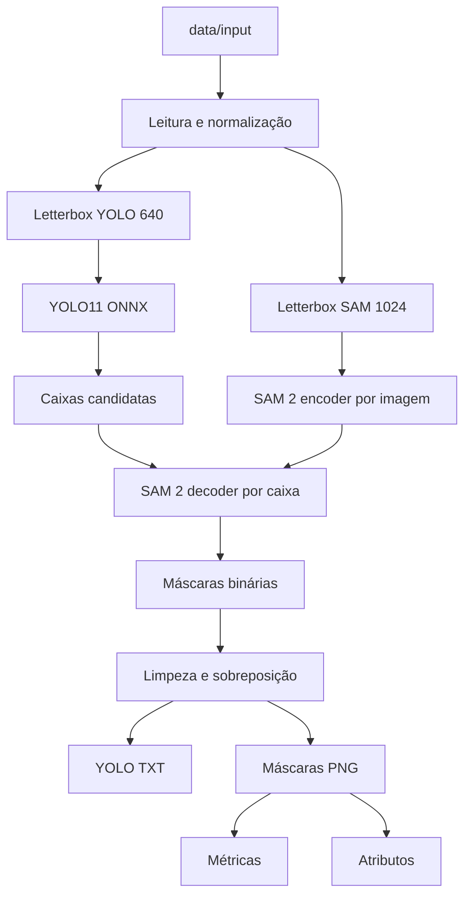
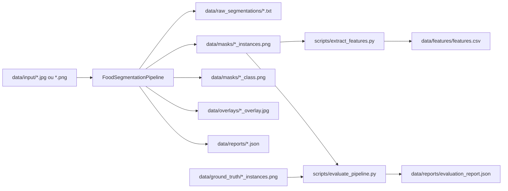

# Visão Geral do Pipeline

Este documento descreve a fronteira metodológica do repositório. A proposta é
manter um pipeline pequeno, reprodutível e adequado para investigação inicial
em segmentação de alimentos a partir de imagens de pratos.

## Escopo

O repositório cobre a etapa de visão computacional:

- preparar a imagem de entrada sem distorcer sua geometria;
- detectar regiões candidatas de alimento com YOLO11;
- usar as caixas detectadas como prompts para o SAM 2;
- converter máscaras para artefatos simples de versionar e avaliar;
- comparar predições com máscaras de referência;
- extrair atributos iniciais das instâncias segmentadas.

Ficam fora deste escopo, por enquanto, a interface mobile, o backend de produto,
o banco de dados nutricional e o modelo final de identificação alimentar.

## Fluxo Experimental



O desenho separa duas funções: YOLO11 reduz o espaço de busca ao localizar
alimentos prováveis; SAM 2 refina a região em uma máscara de instância. Essa
separação facilita testes em CPU e permite trocar detector, limiares ou
pos-processamento sem alterar toda a arquitetura.

## Dados de Entrada

As imagens de estudo ficam em `data/input/`. A captura ideal é feita de cima
(`top-down`), com prato centralizado, boa iluminação e baixa oclusão. Essas
condições ainda não resolvem o problema, mas reduzem variáveis externas que
atrapalham a análise do modelo.

As anotações de referência ficam em `data/ground_truth/`:

```text
<imagem>_instances.png
<imagem>_classes.png
<imagem>_labelstudio.json
class_map.json
```

Para avaliação quantitativa, a máscara de instância deve ser PNG de canal
único. Cada valor diferente de zero representa uma instância anotada. Máscaras
em JPEG não devem ser usadas porque a compressão altera os valores dos pixels.

## Artefatos



Os arquivos em `data/raw_segmentations/`, `data/masks/`, `data/overlays/`,
`data/reports/`, `data/features/` e `outputs/` são saídas derivadas. Em geral,
eles devem ser regenerados a partir de imagens, configurações e modelos.

## Anotações com Label Studio

Exportações brutas do Label Studio são tratadas como insumo temporário:

```text
data/annotation_exports/labelstudio/brush_masks/*.png
data/annotation_exports/labelstudio/result_coco.json
```

Elas podem ser convertidas para máscaras canônicas com:

```bash
uv run python scripts/import_labelstudio_brush.py \
  --brush-dir data/annotation_exports/labelstudio/brush_masks \
  --coco-json data/annotation_exports/labelstudio/result_coco.json
```

O importador associa tarefas às imagens por ordem natural: `task-1` corresponde
a `imagem1`, `task-2` a `imagem2`, e assim por diante. Para reimportar uma
tarefa específica:

```bash
uv run python scripts/import_labelstudio_brush.py --brush-dir data/png --task-id 4
```

## Validação

A avaliação combina métricas globais e por instância:

- IoU e Dice para sobreposição entre predição e referência;
- precision/recall por instância para medir objetos perdidos ou extras;
- erro de área para observar distorção de tamanho;
- overlays para inspeção qualitativa de falhas.

Essa combinação é importante porque uma média global pode esconder erros
relevantes, como pequenos alimentos perdidos, máscaras sobrepostas ou detecções
em regiões que não são alimento.

## Integração Futura

Em uma versão de produto, o aplicativo mobile deve cuidar apenas da captura:
orientação, enquadramento, metadados e envio da imagem. O backend deve chamar
este pipeline como módulo de análise, preservando a mesma configuração usada
nos experimentos. Essa separação ajuda a manter rastreabilidade entre resultados
de pesquisa e comportamento do sistema.
