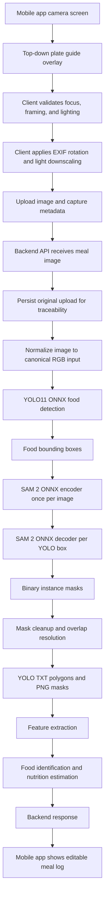
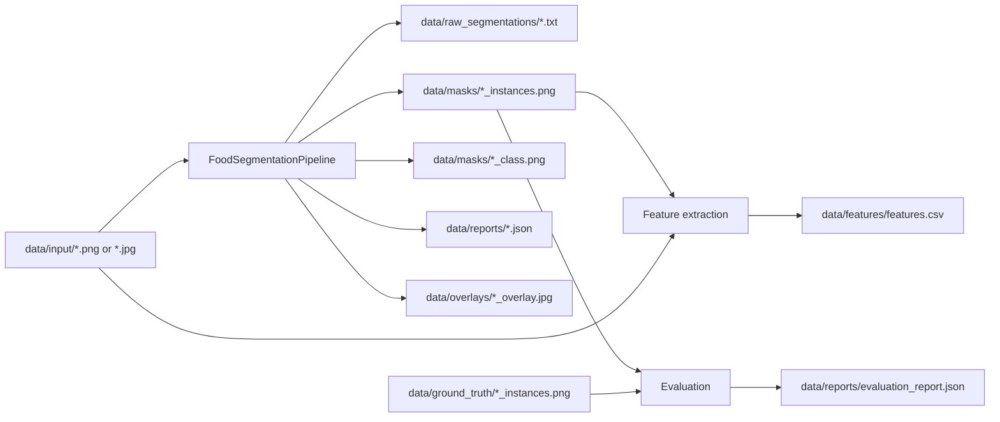

# Prato do Dia Pipeline Overview

This document sketches the full product flow while keeping this repository
focused on the segmentation and identification algorithm.

## End-to-End Flow



## Mobile App Draft

The mobile app should stay responsible for capture ergonomics, not model
preprocessing.

Expected responsibilities:

- Show a top-down plate overlay so the meal is centered and consistently sized.
- Warn on obvious capture problems such as blur, strong shadows, or clipped
  plate boundaries.
- Apply EXIF rotation before upload.
- Optionally downscale very large phone images to reduce network cost.
- Preserve the original image format when possible and upload metadata such as
  device model, timestamp, approximate focal length, and client app version.
- Do not letterbox, normalize tensors, run model-specific color conversion, or
  alter masks client-side.

Example upload payload:

```json
{
  "image": "<multipart file>",
  "capture": {
    "client_image_width": 1536,
    "client_image_height": 2048,
    "exif_rotation_applied": true,
    "plate_overlay_version": "draft-1",
    "captured_at": "2026-05-25T17:00:00Z"
  }
}
```

## Backend API Draft

The backend API should be a thin orchestrator around this repository's
algorithm package. It should not duplicate detector, segmenter, postprocessing,
or metric logic.

Suggested endpoints:

```text
POST /v1/meals:analyze
  multipart image upload
  returns meal analysis job result or accepted job ID

GET /v1/meals/{meal_id}
  returns stored analysis, nutrition estimates, and user corrections

PATCH /v1/meals/{meal_id}
  saves user corrections to food labels, quantities, or masks
```

Synchronous response sketch:

```json
{
  "meal_id": "meal_123",
  "image": {
    "width": 294,
    "height": 291
  },
  "instances": [
    {
      "instance_id": 1,
      "food_label": "rice",
      "food_confidence": 0.82,
      "segmentation": {
        "class_id": 0,
        "polygon": [[0.34, 0.15], [0.42, 0.17], [0.51, 0.31]],
        "area_px": 6940
      },
      "nutrition_estimate": {
        "grams": 120,
        "calories": 156,
        "protein_g": 3.2,
        "carbs_g": 34.0,
        "fat_g": 0.4
      }
    }
  ],
  "artifacts": {
    "annotation_txt": "data/raw_segmentations/imagem1.txt",
    "instance_mask_png": "data/masks/imagem1_instances.png",
    "metadata_json": "data/reports/imagem1.json"
  }
}
```

## Algorithm Boundary

This repository owns:

- Server-side image loading and RGBA/background normalization.
- Letterbox preprocessing for YOLO11 and SAM 2.
- ONNX Runtime CPU inference.
- YOLO box decoding and NMS.
- SAM 2 box-prompted masks.
- Deterministic mask postprocessing and overlap resolution.
- YOLO TXT polygon export.
- Instance/class PNG mask export.
- Evaluation against single-channel PNG ground truth.
- Feature extraction from segmented instances.

Future API/mobile implementation should call this pipeline instead of
reimplementing these steps.

## Artifact Flow


